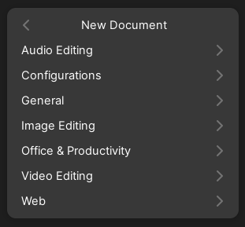

# awesome-linux-templates
A collection of shared file templates for use in $XDG_TEMPLATE_DIR folder which is usually $HOME/Templates on Linux systems.
This is forked from exquisite-linux-templates

## A note about the Templates directory
Despite being an XDG standard, and being available out of the box on most Linux distributions,
the $HOME/Templates directory is not widely understood by new users, despite being an incredibly
useful and time-saving tool.

The concept of the Templates directory is that it allows you to save files of ANY type which
can serve as the starting points for creating new files. Most popular Linux file browsers,
including Nautilus and Pantheon Files, automatically populate a menu when right-clicking an empty area
that allows you to create a new file. This menu is populated by the files stored in your Templates
folder.

### Format
These template files must be named with what you wish for the menu entry to be, and given an extension that
correctly matches the file type.

For example, if I have a Python file template, I might name it `Python File.py`

Any content saved within the template file will be recreated when generating a new file.

## Contributing to the project
Please feel free to contribute files which you find especially useful and elegant. If we feel that the
quality is up to par with the rest of the repository, and could potentially be useful to multiple users
(i.e. not an individualized use case) we will gladly merge the PR.

Please keep the following requirements in mind:
* You may only include files which you have created, or files with licensing permitting us to include it in our project.
* If you copy material from a website, you must obtain the author's permission for use specifically in this project.

## Using the files
The super simple, and therefore recommended, method of using these files is to either downlaod the .zip file or clone the repository into a new directory, then select the files which would be useful for you and copy them to your Templates directory.

The files in this repository are categorized to make them easier to browse.

If you so desire, you _can_ recreate the directory structure in your own $HOME/Templates directory, or can even
copy and paste from the repository entirely. Most file browsers display these as additional menu dropdowns.
